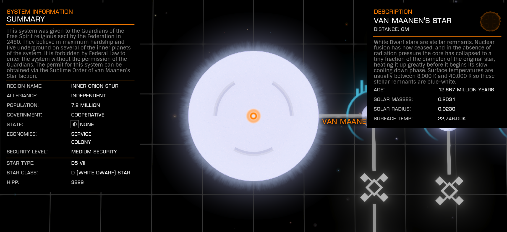

:PROPERTIES:
:ID:       2437a94e-3728-40bd-84d5-541be4c73854
:ROAM_REFS: https://elite-dangerous.fandom.com/wiki/Van_Maanen's_Star
:END:
#+title: Van Maanen's Star
#+filetags: :Reputation:System:Permit:

#+begin_quote
This system was given to the Guardians of the Free Spirit religious
sect by the Federation in 2480. They believe in maximum hardship and
live underground on several of the inner planets of the system. It
is forbidden by Federal Law to enter the system without the
permission of the Guardians. The permit for this system can be
obtained via the [[id:b6c2e639-b66e-4821-ad33-5bd7ceb328fd][Sublime Order of Van Maanen's Star]] faction.
#+end_quote

[[file:img/permit.png]]

- Faction: [[id:b6c2e639-b66e-4821-ad33-5bd7ceb328fd][Sublime Order of Van Maanen's Star]]
- Benefits: none known
- Give exploration data to [[id:da11b7b5-2c5a-4f17-9cd4-ce28a2f34dbd][Tau-Ceti]] system.

