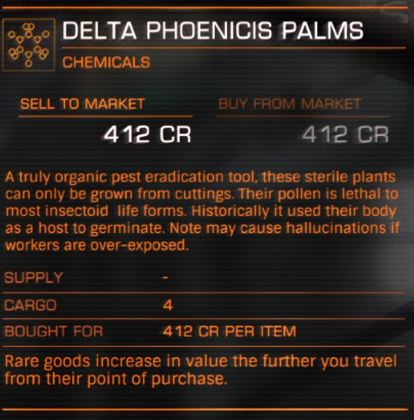

:PROPERTIES:
:ID:       160c1b69-593a-48e1-a464-08addd9ab01c
:END:
#+title: Delta Phoenicis Palms
#+filetags: :Commodity:rare:

#+begin_quote
A truly organic pest eradication tool, these sterile plants can only
be grown from cuttings. Their pollen is lethal to most insectoid
life forms. Historically it used their bodies as a host to
germinate. Note this may cause hallucinations if workers are over-
exposed. This rare good is legal in all systems. Please note that if
a system's controlling faction changes, some formerly legal rare
goods may become illegal in that system. If this happens, the rare
goods in question will no longer be available for sale or purchase.
#+end_quote

Sold as a rare commodity at [[id:2cb2cbb2-b443-4f91-94dc-779c4d5dd1b0][Trading Post]], [[id:3ce92806-7e34-49f1-9dd0-a0ab2eb7277c][Delta Phoenicis]].

Sources: in-game commodity description, mirrored at [[https://inara.cz/elite/commodity/10001/][Inara: Delta Phoenicis Palms]]

