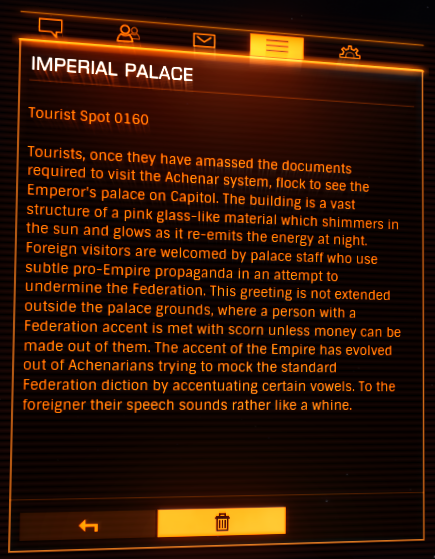

:PROPERTIES:
:ID:       905c6013-0368-4eb2-b531-0bae8cad5f89
:END:
#+title: Imperial Palace
#+filetags: :Tourist:History:beacon:
* 0160 Imperial Palace
[[id:bed8c27f-3cbe-49ad-b86f-7d87eacf804a][Achenar]]

Tourists, once they have amassed the documents required to visit the [[id:bed8c27f-3cbe-49ad-b86f-7d87eacf804a][Achenar]] system, flock to see the Emperor's palace on Capitol. The building is a vast structure of a pink glass-like material which shimmers in the sun and glows as it re-emits the energy at night. Foreign visitors are welcomed by palace staff who use subtle pro-Empire propaganda in an attempt tp undermine the Federation. This greeting is not extended outside the palace grounds, where a person with a Federation accent is met with scorn unless money can be made out of them. The accent of the Empire has evolved out of Achenarians trying to mock the standard Federation diction by accentuating certain vowels. To the foreigner their speech sounds rather like a whine.

