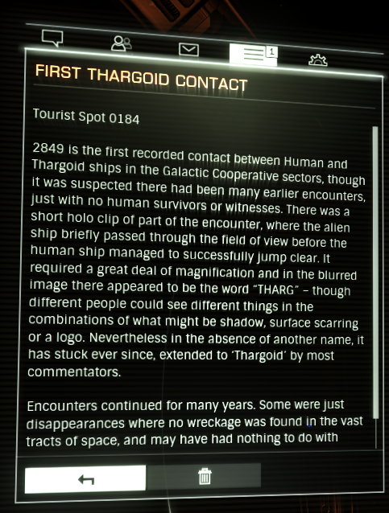
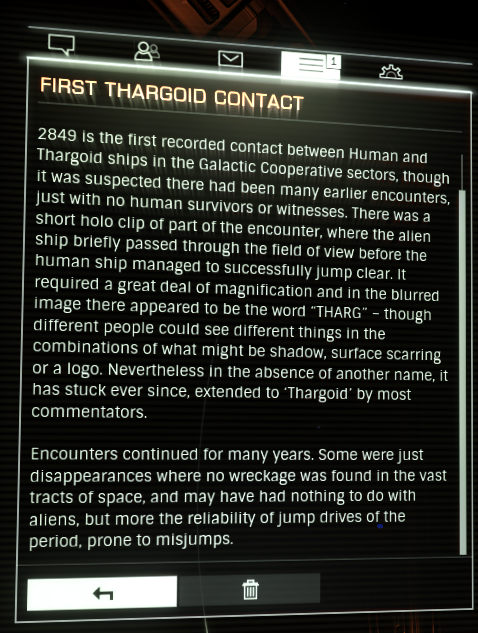

:PROPERTIES:
:ID:       c4f9cbc3-e1fe-43dd-8100-cee07c19744f
:END:
#+title: First Thargoid Contact
#+filetags: :Tourist:History:beacon:
* 0184 First Thargoid Contact
[[id:ff595332-6a13-4f69-ae2f-cc0a0df8e741][Lave]]

2849 is the first recorded contact between Human and Targoid ships in the Galactic Cooperative sectors, though it was suspected there had been many eralier encounters, just with no human survivors or witnesses. There was a short holo clip of part of the encounter, where the alien ship briefly passed through the field of view before the human ship managed to successfully jump clear. It required a great deal of magnification and in the blurred image there appeared to be the word "THARG" - but though different people could see different things in the combinations of what might be a shadow, surface scarring or a logo. Nevertheless in the absence of another name, it has stuck ever since, extended to 'Thargoid' by most commentators.

Encounters continued with many years. Some were just disappearances where no wreckage was found in the vast tracts of space, and may have had nothing to do with aliens, but more the reliability of jump drives of the period, prone to misjumps.

