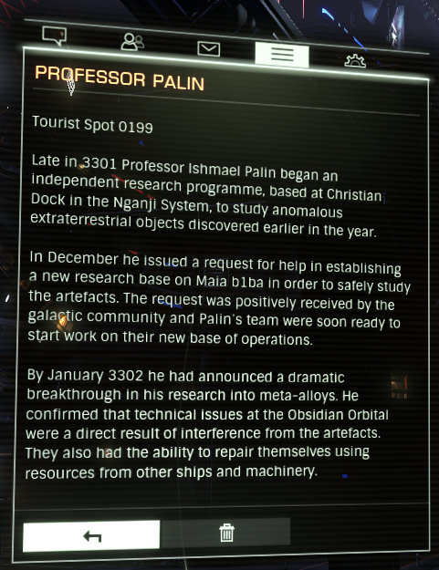

:PROPERTIES:
:ID:       79ddf44d-7d17-4026-90c2-f39013e75ee7
:END:
#+title: Professor Palin
#+filetags: :Tourist:History:beacon:
* 0199 Professor Palin
[[id:7add3518-a625-4de5-a12a-e115da9f268d][Nganji]]

Late in 3301 [[id:8f63442a-1f38-457d-857a-38297d732a90][Professor Ishmael Palin]] began an independent research programme, based at Christian Dock in the Nganji System, to study anomalous extraterrestrial objects discovered earlier in the year.

In December he issued a request for help in establishing a new research base on Maia b1ba in order to safely study the artefacts. The request was positively received by the galactic community and Palin's team was soon ready to start work on their new base of operations.

By January 3302 he had announced a dramatic breakthrough in his research into meta-alloys. He confirmed that technical issues at the [[id:4223b99a-7e0c-44fa-b7e9-afeca7e0c031][Obsidian Orbital]] were a direct result of interference from the artefacts. They also had the ability to repair themself using resources from other ships and machinery.

