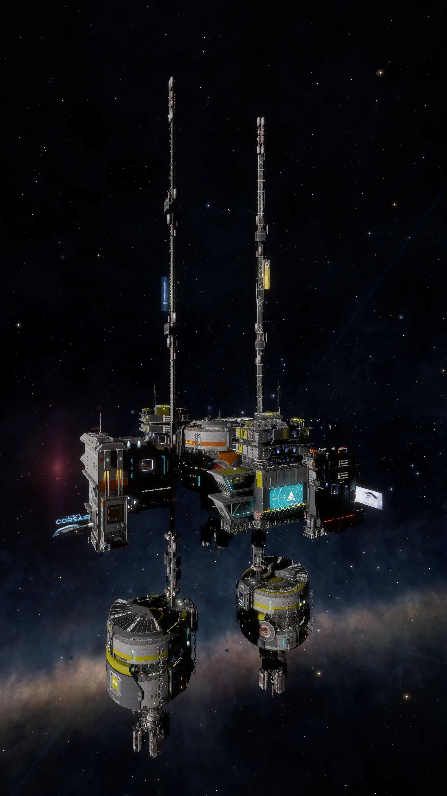

:PROPERTIES:
:ID:       86d6e4c8-73ff-41dd-9f68-24e8cf189315
:END:
#+title: Eagle Eye installations

The Eagle Eye installations play a vital role in countering Thargoid
aggression by monitoring energy-level fluctuations at Thargoid surface
sites. The data allows pilots to determine which systems the Thargoids
intend to attack.

* Installation Locations
- Eagle Eye One: [[id:93410322-85eb-4d58-ae0e-c99b5faf3e02][HIP 17692]] A 3
- Eagle Eye Two: [[id:88b4c43a-47da-4389-87a0-f929f25a40f3][HR 1185]] A 5
- Eagle Eye Three: [[id:203e2365-af25-465d-89f5-8ac3df7b9d3e][HIP 17892]] 1 a
- Eagle Eye Four: [[id:acffcea9-44ae-4689-8bc9-74f65c75e0ae][HIP 17225]] A 5
- Eagle Eye Five: [[id:287ae6a7-95e6-4a7a-9108-01f8995753fc][Pleiades Sector KC-V c2-4]]
- Eagle Eye Six: [[id:846bfbc7-75e7-4d8d-8716-7fe0346026f4][Pleiades Sector IR-W d1-55]] 2

* Eagle Eye One
* Eagle Eye Two
* Eagle Eye Three
* Eagle Eye Four
* Eagle Eye Five

* Eagle Eye Six
