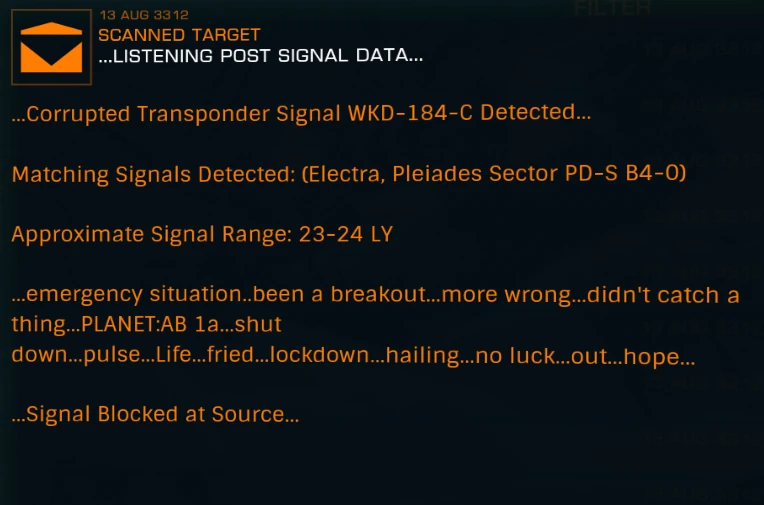

:PROPERTIES:
:ID:       287ae6a7-95e6-4a7a-9108-01f8995753fc
:ROAM_REFS: https://canonn.science/codex/penal-colony-bv-2259/
:END:
#+title: Pleiades Sector KC-V c2-4 5
#+filetags: :ListeningPost:

A listening post related to the abandoned [[id:e121d10f-8ea7-4842-8988-4b3aec463ebf][Penal Colony BV-2259]] can be found near [[https://edgis.elitedangereuse.fr/static/sysmap.html?system=Pleiades+Sector+KC-V+c2-4&body_id=12][Pleiades Sector KC-V c2-4 5]].

#+begin_quote
…LISTENING POST SIGNAL DATA…

…Corrupted Transponder Signal WKD-184-C Detected…

Matching Signals Detected: ([[id:8e9b5a29-b9a6-4987-8fcd-91234a4a0acd][Electra]], [[id:7778d101-a0ed-4943-b9a7-b93aded323d9][Pleiades Sector PD-S B4-0]])

Approximate Signal Range: 23-24 LY

…emergency situation…been a breakout…more wrong…didn’t catch a thing…PLANET:AB 1a…shut down…pulse…Life…fried…lockdown…hailing…no luck…out…hope…

…Signal Blocked at Source…
#+end_quote

