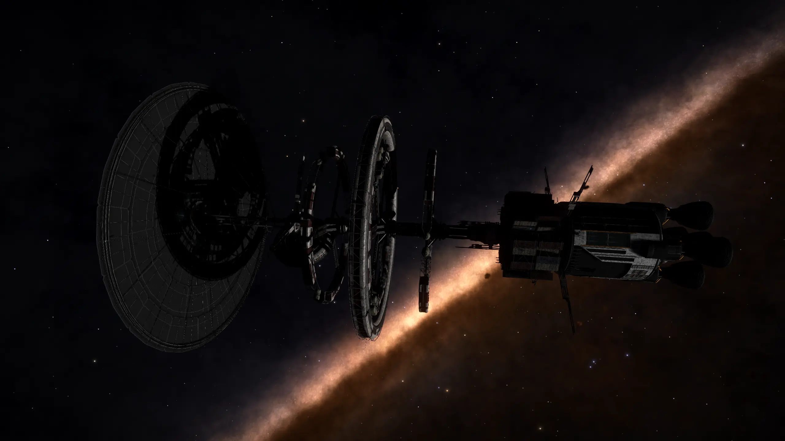

:PROPERTIES:
:ID:       bce186ef-7641-4b58-9617-ab6494952308
:ROAM_REFS: https://canonn.science/codex/generation-ship-phobos/
:END:
#+title: Phobos
#+filetags: :ship:

Phobos is an abandoned [[id:951f3d20-c3aa-41cc-ba58-cc7d3a5a1d07][Generation Ship]] that can be found in the
[[id:043d80b9-4bb0-4ce2-9655-a6687ac4a5e9][Coelachi]] system.

The location is revealed by the [[id:4df4a36a-20bf-43ca-9bf1-2324f832ab81][Listening Post]] in the [[id:1e5f2eeb-0139-464a-abe0-d80d5c5d2a14][Col 285 Sector AV-M b21-5]] system, orbiting [[https://edgis.elitedangereuse.fr/static/sysmap.html?system=Col+285+Sector+AV-M+b21-5&body_id=1][body 1]]

* Logs

#+begin_quote
NOT WELCOME 1/4
Medical Officers Log 6933:

We’ve done it. We’re down on the surface and the habitats are all fully operational. No more supply runs to the ship and back! We’ve established five settlements in this region with another ten spread across the other regions. The elected leaders of each group have voted and declared the mission a success. Many of the settlements have decommissioned their landers as a sign of this, even holding ceremonies to celebrate our new life here.

However, it appears our new home may not be as welcoming as we had hoped for. Much of the indigenous flora and fauna have proven to be toxic and highly aggressive.

Several of the crew have been attacked while gathering food and supplies and we have lost a few people to various incidents involving local plant life.

Settlement Alpha and Beta have also been having problems with animal attacks. By all accounts they’ve had it worse than us with entire teams being lost.

We’ve posted additional sentries to guard the settlement, but we’re not a military operation, we’re explorers and colonists. The best we have is an ex-security officer to keep us safe. We were simply not expecting such a hostile environment.
#+end_quote
[[file:audio/GenerationShips/Phobos/Phobos-Not-Welcome-1-4.ogg]]

#+begin_quote
NOT WELCOME 2/4
Medical Officers Log 7463

The creatures got into our habitats. Oh god it was a massacre. So many dead, women, children. They ate... Oh god. I think I’m going to be sick.

We can’t stay here. Correll has gathered up everyone he could find and we’re heading for settlement Delta in the mountains east of here. Hopefully we can find some shelter up there. Correll said something about them keeping the lander intact as an emergency measure. Maybe we can use that to get back to the ship.
#+end_quote
[[file:audio/GenerationShips/Phobos/Phobos-Not-Welcome-2-4.ogg]]

#+begin_quote
NOT WELCOME 3/4
Medical Officers Log 7467

We reached Settlement Delta this morning, only... there’s no one here. There are signs of what looks like a fight and barricades in some of the bigger buildings. It looks like they tried to use the main hab as a shelter, but whatever attacked them tunnelled in through the floors.

I can’t shake the feeling that these animals are watching us, biding their time. It feels like we’re being hunted.

At least the rumours about the launcher are true. It’s here and fully intact. It seems as if our friends had turned it into a monument rather than break it down like the rest of us did. We’ve managed to locate the orbiting ship’s beacon and made the necessary calculations for a launch. Our only problem is the fuel cells. They are dry. Huke, our engineer, seems to think he can get some from the other building in the settlement. It will just take a little time, a couple of days maybe. All we can do is wait and keep our guard up until we can get off this planet.
#+end_quote
[[file:audio/GenerationShips/Phobos/Phobos-Not-Welcome-3-4.ogg]]

#+begin_quote
NOT WELCOME 4/4
Medical Officers Log 7475

Somehow, I don’t know how, one of those things got on board. It must have been in the lander when we launched.

We’ve managed to trap it in the farm pods, but not before it killed all but three of us. Halil won’t make it through the night, the thing mauled him pretty badly. All we can do is keep him doped up on pain meds. As for Huke and me, without access to the farms, we’re living on borrowed time. We were in the process of setting everything back up when the creature attacked. We only have the few day’s rations that were on the lander... wait... what was that!

No, no, no, no... How did it get out?! This can’t be happening... it can’t be happening...
#+end_quote
[[file:audio/GenerationShips/Phobos/Phobos-Not-Welcome-4-4.ogg]]
