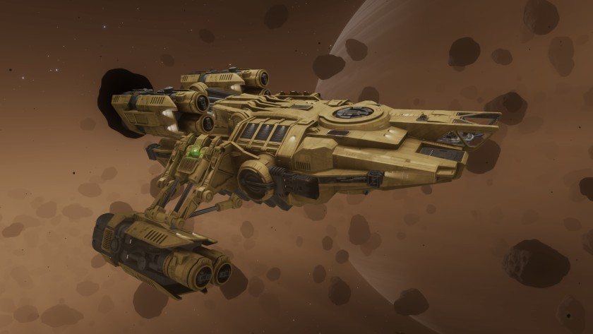

:PROPERTIES:
:ID:       63529529-bb50-4c71-9fd8-cbc7ed723347
:ROAM_REFS: https://www.elitedangerous.com/equipment/starships/type-11-prospector
:END:
#+title: Type-11 Prospector
#+filetags: :3311:3312:ship:

Mining vessel by [[id:906c77b7-7fe4-48c1-ace5-1265023c2ebf][Lakon Spaceways]] released in 3311 and brought into full production in 3312.

Built upon the successful [[id:cbcc7192-cc42-4692-875e-71381c29eb33][Type-8]] platform, [[id:906c77b7-7fe4-48c1-ace5-1265023c2ebf][Lakon Spaceways]] has
positioned the Type-11 Prospector to redefine medium-sized mining
efficiency. Bespoke modules, lightweight construction materials and a
no compromise cargo capacity makes the Type-11 the obvious choice for
the modern miner. A redesigned and reinforced drive housing grants the
Type-11 superior management of overcharged [[id:46a9c980-af48-4e43-a820-9971d7c76c34][Frame Shift Drives]].

The Type-11 Prospector has been designed for medium-size landing pads.

* Shipyard Stats
- Fighter bay: Yes
- Multicrew: +2
- Landing pad size: MED
- Speeds: 271 m/s top, 351 m/s boost
- Maneuverability: 2
- Jump range: 13.41 ly laden, 15.81 ly unladen
- Durability: 271 shields, 630 armour
- Hull mass: 320 t
- Cargo capacity: 64 t
- Dimensions: 28.7 m high, 78.6 m long, 78.3 m wide
