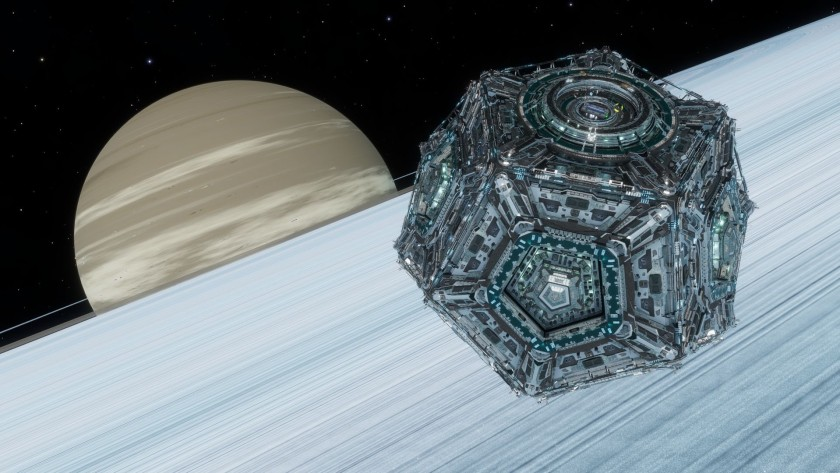

:PROPERTIES:
:ID:       4a94cb18-f45e-4484-8798-354b193f8e6a
:END:
#+title: Dodec
#+filetags: :starport:

A [[id:83cc5ab9-e42c-4049-b6ed-081927b0b286][starport]] design offered by [[id:d9459015-dae3-4233-9eb7-a2fb11344097][Brewer Corporation]] for [[id:d1f19609-fdb7-4991-bcb2-e93435f013d0][colonisation]] efforts. In 3311 it was presented as a smaller option available for Tier 3 port locations.

