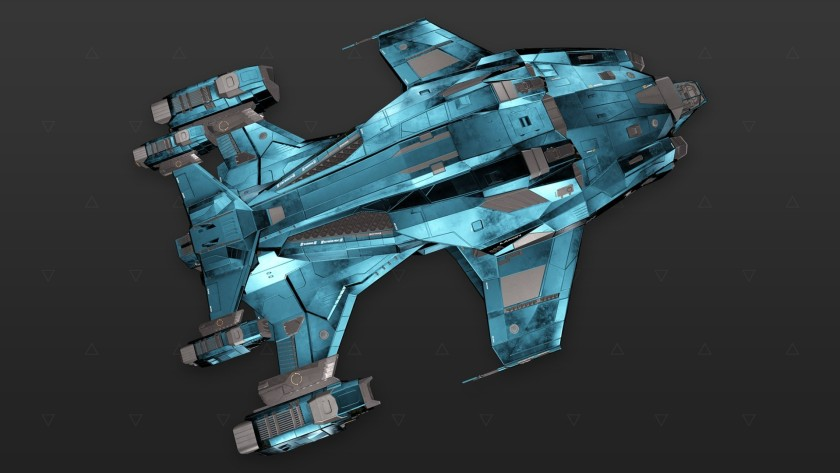

:PROPERTIES:
:ID:       fe217cf0-e290-40da-a6a2-29d621005a7c
:ROAM_REFS: https://www.elitedangerous.com/equipment/starships/alliance-challenger
:END:
#+title: Alliance Challenger
#+filetags: :ship:

* Shipyard Stats
- Fighter bay: No
- Multicrew: +1
- Landing pad size: MED
- Speeds: 204 m/s top, 316 m/s boost
- Maneuverability: 4
- Jump range: 7.98 ly laden, 8.61 ly unladen
- Durability: 208 shields, 540 armour
- Hull mass: 450 t
- Cargo capacity: 40 t
- Dimensions: 19.7 m high, 68.4 m long, 48.4 m wide

