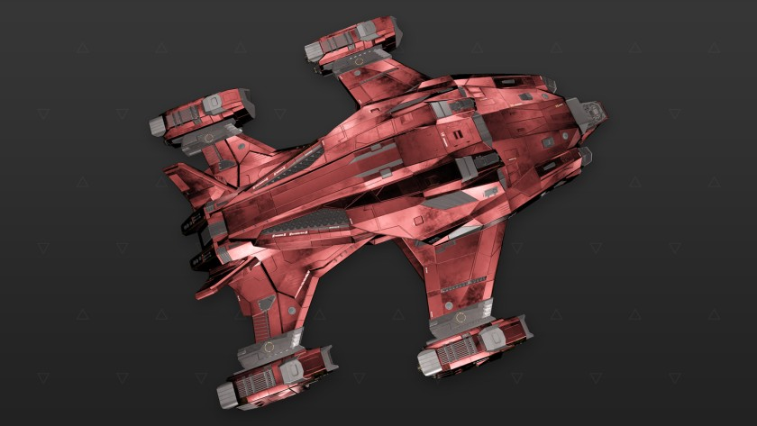

:PROPERTIES:
:ID:       3c857ece-19f1-4aa6-84a7-bb7c56001915
:ROAM_REFS: https://www.elitedangerous.com/equipment/starships/alliance-chieftain
:END:
#+title: Alliance Chieftain
#+filetags: :ship:

* Shipyard Stats
- Fighter bay: No
- Multicrew: +1
- Landing pad size: MED
- Speeds: 235 m/s top, 338 m/s boost
- Maneuverability: 4
- Jump range: 8.84 ly laden, 9.62 ly unladen
- Durability: 162 shields, 504 armour
- Hull mass: 400 t
- Cargo capacity: 40 t
- Dimensions: 20 m high, 68.1 m long, 58.5 m wide

