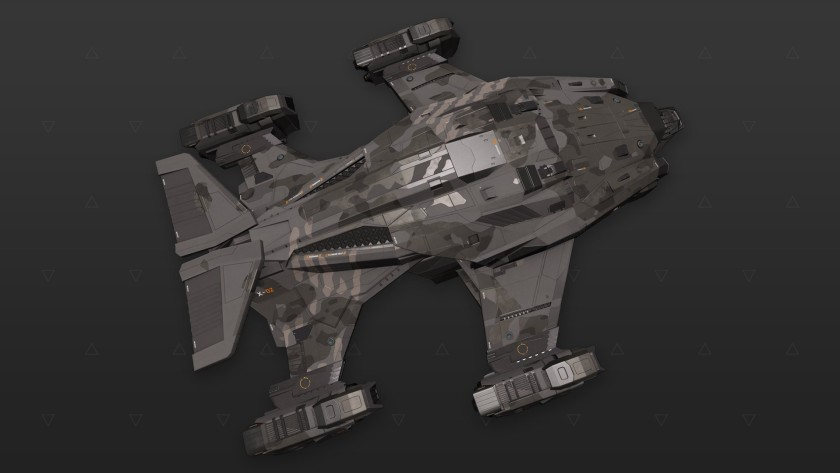

:PROPERTIES:
:ID:       771c6b36-52cf-4fde-9901-fa1ac17e665a
:ROAM_REFS: https://www.elitedangerous.com/equipment/starships/alliance-crusader
:END:
#+title: Alliance Crusader
#+filetags: :ship:

* Shipyard Stats
- Fighter bay: Yes
- Multicrew: +3
- Landing pad size: MED
- Speeds: 183 m/s top, 305 m/s boost
- Maneuverability: 3
- Jump range: 7.66 ly laden, 8.24 ly unladen
- Durability: 126 shields, 540 armour
- Hull mass: 500 t
- Cargo capacity: 40 t
- Dimensions: 19.8 m high, 68.1 m long, 58.5 m wide

