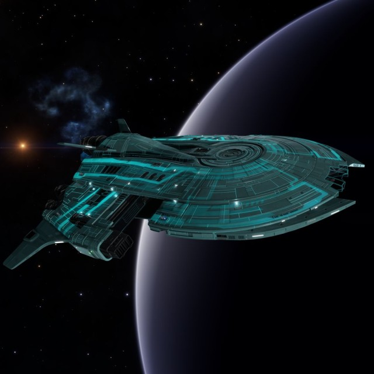

:PROPERTIES:
:ID:       68dd801e-ab32-4883-95ff-3ce42d5e2e6d
:ROAM_REFS: https://www.elitedangerous.com/equipment/starships/caspian-explorer
:END:
#+title: Caspian Explorer
#+filetags: :ship:

* Shipyard Stats
- Fighter bay: Yes
- Multicrew: +3
- Landing pad size: LRG
- Speeds: 205 m/s top, 283 m/s boost
- Maneuverability: 2
- Jump range: 19.38 ly laden, 21.83 ly unladen
- Durability: 196 shields, 621 armour
- Hull mass: 950 t
- Cargo capacity: 96 t
- Dimensions: 27.6 m high, 126.7 m long, 104.5 m wide

