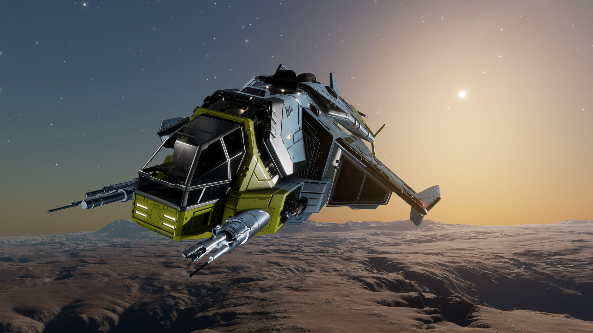

:PROPERTIES:
:ID:       afcad21d-a5de-42f4-a02a-807913f43051
:ROAM_REFS: https://www.elitedangerous.com/equipment/starships/diamondback-explorer
:END:
#+title: Diamondback Explorer
#+filetags: :ship:

* Shipyard Stats
- Fighter bay: No
- Multicrew: -
- Landing pad size: SML
- Speeds: 251 m/s top, 328 m/s boost
- Maneuverability: 4
- Jump range: 15.2 ly laden, 17.03 ly unladen
- Durability: 131 shields, 270 armour
- Hull mass: 260 t
- Cargo capacity: 12 t
- Dimensions: 13.6 m high, 45 m long, 27.3 m wide

