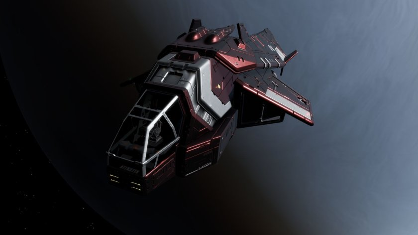

:PROPERTIES:
:ID:       8f02bc33-0f60-4c37-a588-2c610c86903f
:ROAM_REFS: https://www.elitedangerous.com/equipment/starships/diamondback-scout
:END:
#+title: Diamondback Scout
#+filetags: :ship:

* Shipyard Stats
- Fighter bay: No
- Multicrew: -
- Landing pad size: SML
- Speeds: 283 m/s top, 384 m/s boost
- Maneuverability: 5
- Jump range: 11.44 ly laden, 12.17 ly unladen
- Durability: 93 shields, 216 armour
- Hull mass: 170 t
- Cargo capacity: 0 t
- Dimensions: 12.3 m high, 39 m long, 24.3 m wide

