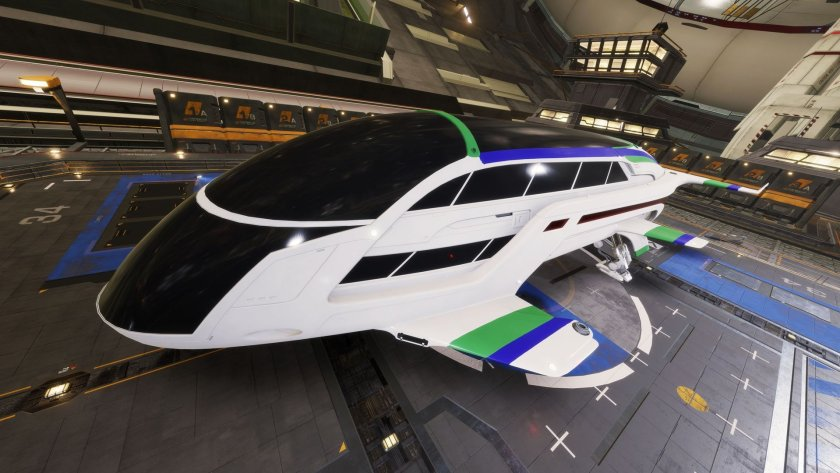

:PROPERTIES:
:ID:       0abbce5e-c94f-4439-83a3-513f6d49487d
:ROAM_REFS: https://www.elitedangerous.com/equipment/starships/dolphin
:END:
#+title: Dolphin
#+filetags: :ship:

* Shipyard Stats
- Fighter bay: No
- Multicrew: -
- Landing pad size: SML
- Speeds: 258 m/s top, 361 m/s boost
- Maneuverability: 3
- Jump range: 10.19 ly laden, 11.39 ly unladen
- Durability: 143 shields, 198 armour
- Hull mass: 140 t
- Cargo capacity: 14 t
- Dimensions: 8.8 m high, 51.8 m long, 20.8 m wide

