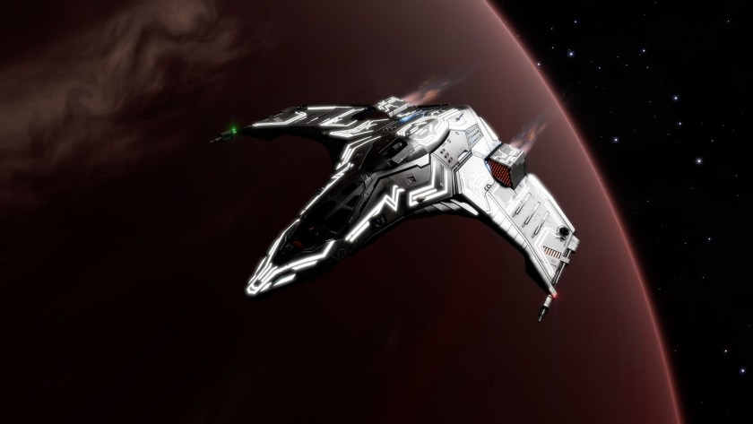

:PROPERTIES:
:ID:       931aaf02-a1e2-4f79-8a06-df74f58496f2
:ROAM_REFS: https://www.elitedangerous.com/equipment/starships/eagle
:END:
#+title: Eagle
#+filetags: :ship:

* Shipyard Stats
- Fighter bay: No
- Multicrew: -
- Landing pad size: SML
- Speeds: 240 m/s top, 350 m/s boost
- Maneuverability: 6
- Jump range: 8.62 ly laden, 9.15 ly unladen
- Durability: 78 shields, 72 armour
- Hull mass: 50 t
- Cargo capacity: 2 t
- Dimensions: 7.1 m high, 31.2 m long, 29.7 m wide

