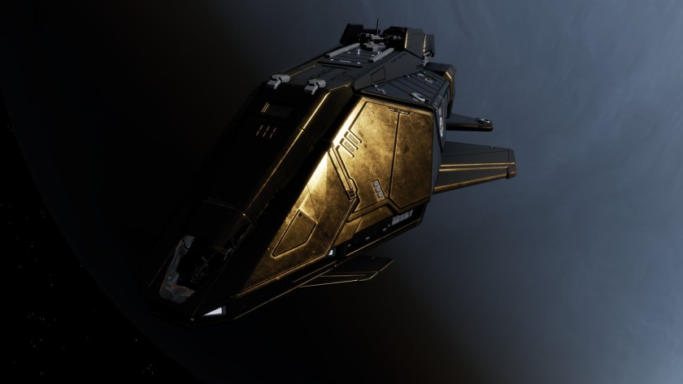

:PROPERTIES:
:ID:       9194aa87-08a1-48b3-a9da-4a883a363490
:ROAM_REFS: https://www.elitedangerous.com/equipment/starships/federal-assault-ship
:END:
#+title: Federal Assault Ship
#+filetags: :ship:

* Shipyard Stats
- Fighter bay: No
- Multicrew: +1
- Landing pad size: MED
- Speeds: 214 m/s top, 357 m/s boost
- Maneuverability: 4
- Jump range: 7.96 ly laden, 8.48 ly unladen
- Durability: 133 shields, 540 armour
- Hull mass: 480 t
- Cargo capacity: 32 t
- Dimensions: 22.8 m high, 73.8 m long, 49.5 m wide

