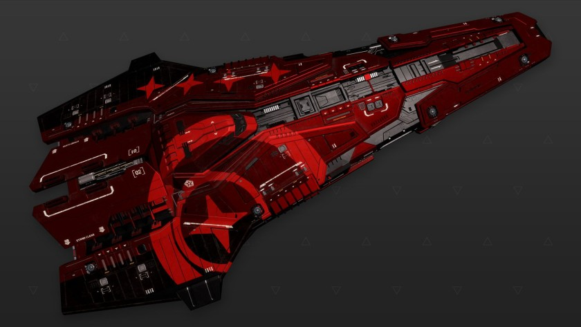

:PROPERTIES:
:ID:       98451bbe-b08e-4617-b9ab-ea938995f24d
:ROAM_REFS: https://www.elitedangerous.com/equipment/starships/federal-corvette
:END:
#+title: Federal Corvette
#+filetags: :ship:

* Shipyard Stats
- Fighter bay: Yes
- Multicrew: +3
- Landing pad size: LRG
- Speeds: 198 m/s top, 257 m/s boost
- Maneuverability: 2
- Jump range: 6.03 ly laden, 6.42 ly unladen
- Durability: 516 shields, 666 armour
- Hull mass: 900 t
- Cargo capacity: 76 t
- Dimensions: 28.3 m high, 167.8 m long, 87.2 m wide

