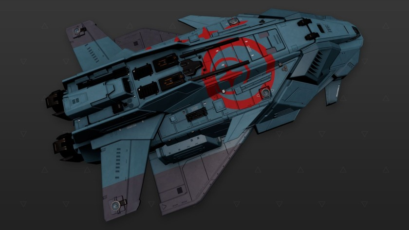

:PROPERTIES:
:ID:       77302a8a-7edb-430d-9f35-28b3442357a9
:ROAM_REFS: https://www.elitedangerous.com/equipment/starships/federal-gunship
:END:
#+title: Federal Gunship
#+filetags: :ship:

* Shipyard Stats
- Fighter bay: Yes
- Multicrew: +1
- Landing pad size: MED
- Speeds: 171 m/s top, 282 m/s boost
- Maneuverability: 2
- Jump range: 6.56 ly laden, 6.78 ly unladen
- Durability: 186 shields, 630 armour
- Hull mass: 580 t
- Cargo capacity: 16 t
- Dimensions: 22.5 m high, 75.5 m long, 53.3 m wide

