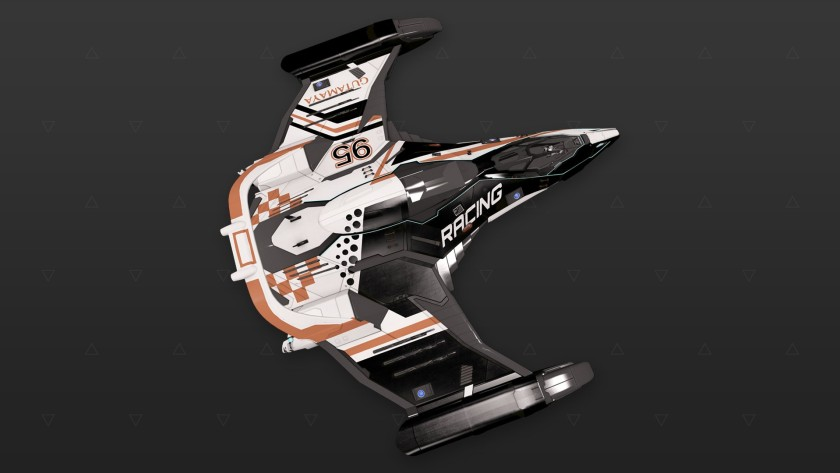

:PROPERTIES:
:ID:       edc79df3-fc93-4801-b459-46dbfd384e79
:ROAM_REFS: https://www.elitedangerous.com/equipment/starships/imperial-eagle
:END:
#+title: Imperial Eagle
#+filetags: :ship:

* Shipyard Stats
- Fighter bay: No
- Multicrew: -
- Landing pad size: SML
- Speeds: 299 m/s top, 398 m/s boost
- Maneuverability: 8
- Jump range: 8.22 ly laden, 8.7 ly unladen
- Durability: 104 shields, 108 armour
- Hull mass: 50 t
- Cargo capacity: 2 t
- Dimensions: 7.1 m high, 31.2 m long, 34.7 m wide

