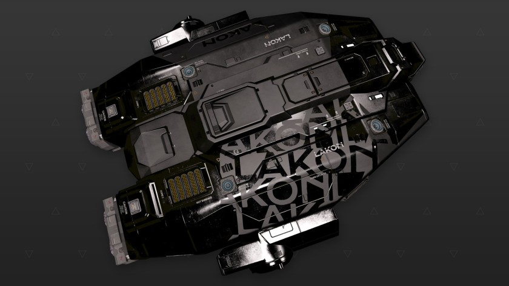

:PROPERTIES:
:ID:       946d2fce-116e-4884-ab36-bdca49a52e70
:ROAM_REFS: https://www.elitedangerous.com/equipment/starships/keelback
:END:
#+title: Keelback
#+filetags: :ship:

* Shipyard Stats
- Fighter bay: Yes
- Multicrew: +1
- Landing pad size: MED
- Speeds: 202 m/s top, 303 m/s boost
- Maneuverability: 2
- Jump range: 9.41 ly laden, 11.7 ly unladen
- Durability: 99 shields, 486 armour
- Hull mass: 180 t
- Cargo capacity: 42 t
- Dimensions: 14.9 m high, 49.7 m long, 40.3 m wide

