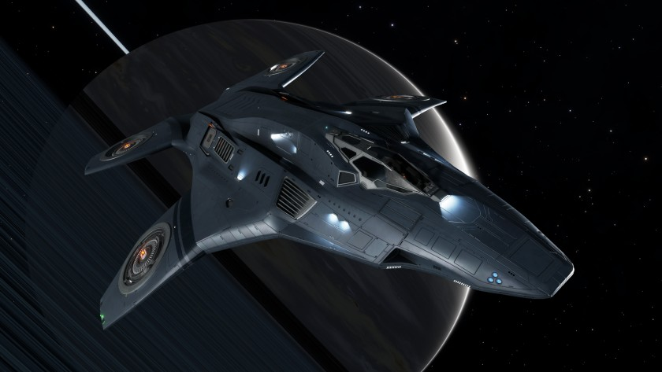

:PROPERTIES:
:ID:       e8a1cc47-c48a-4269-8ee1-726757a9547e
:ROAM_REFS: https://www.elitedangerous.com/equipment/starships/kestrel-mk-ii
:END:
#+title: Kestrel MK II
#+filetags: :ship:

* Shipyard Stats
- Fighter bay: No
- Multicrew: -
- Landing pad size: SML
- Speeds: 278 m/s top, 370 m/s boost
- Maneuverability: 8
- Jump range: 12.54 ly laden, 13.32 ly unladen
- Durability: 293 shields, 126 armour
- Hull mass: 190 t
- Cargo capacity: 4 t
- Dimensions: 9.07 m high, 49.4 m long, 40.01 m wide

