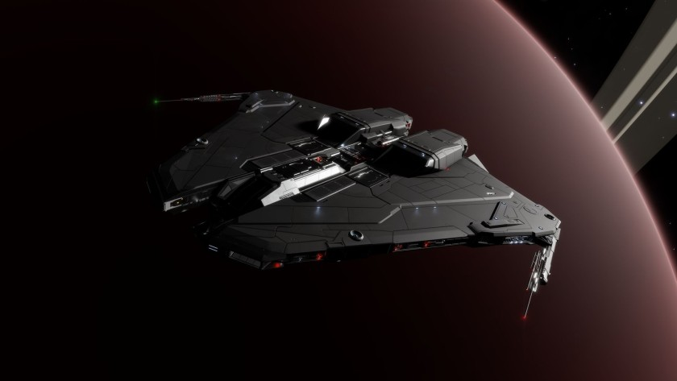

:PROPERTIES:
:ID:       d04cef80-dad9-4e45-bde0-18be251bfcda
:ROAM_REFS: https://www.elitedangerous.com/equipment/starships/krait-mk-ii
:END:
#+title: Krait Mk II
#+filetags: :ship:

* Shipyard Stats
- Fighter bay: Yes
- Multicrew: +2
- Landing pad size: MED
- Speeds: 245 m/s top, 337 m/s boost
- Maneuverability: 3
- Jump range: 7.68 ly laden, 9.01 ly unladen
- Durability: 262 shields, 396 armour
- Hull mass: 320 t
- Cargo capacity: 82 t
- Dimensions: 13.5 m high, 73.3 m long, 72 m wide

