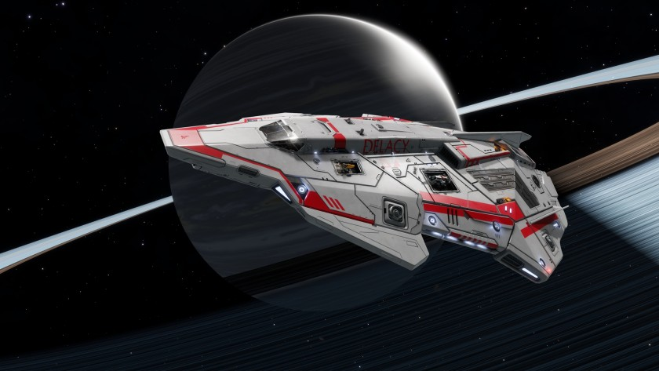

:PROPERTIES:
:ID:       bae9aa9d-8c4e-4ce0-90e9-8aba5d0c8406
:ROAM_REFS: https://www.elitedangerous.com/equipment/starships/python
:END:
#+title: Python
#+filetags: :ship:

* Shipyard Stats
- Fighter bay: No
- Multicrew: +1
- Landing pad size: MED
- Speeds: 234 m/s top, 306 m/s boost
- Maneuverability: 2
- Jump range: 7.38 ly laden, 8.61 ly unladen
- Durability: 294 shields, 468 armour
- Hull mass: 350 t
- Cargo capacity: 82 t
- Dimensions: 18 m high, 87.8 m long, 58.1 m wide

