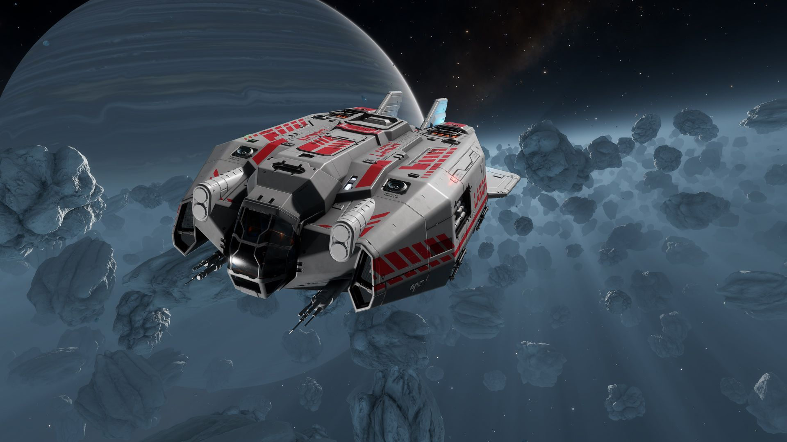

:PROPERTIES:
:ID:       12d73b8e-ce06-4676-9392-949215bdc6e5
:ROAM_REFS: https://www.elitedangerous.com/equipment/starships/type-6-transporter
:END:
#+title: Type-6 Transporter
#+filetags: :ship:

* Shipyard Stats
- Fighter bay: No
- Multicrew: -
- Landing pad size: MED
- Speeds: 223 m/s top, 356 m/s boost
- Maneuverability: 3
- Jump range: 10.15 ly laden, 13.38 ly unladen
- Durability: 77 shields, 324 armour
- Hull mass: 155 t
- Cargo capacity: 50 t
- Dimensions: 15 m high, 48.4 m long, 27.2 m wide

