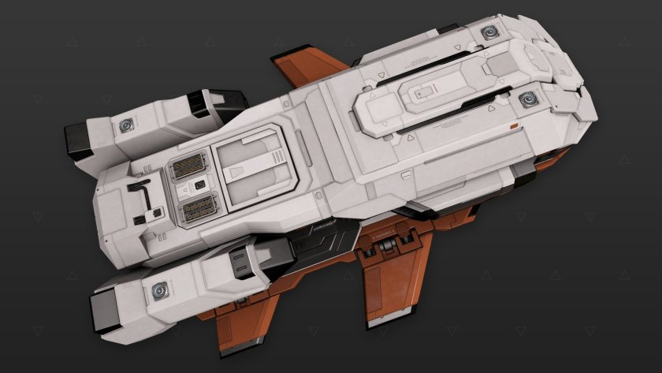

:PROPERTIES:
:ID:       7d0ba432-87db-44d3-8caf-b451f62a830f
:ROAM_REFS: https://www.elitedangerous.com/equipment/starships/type-7-transporter
:END:
#+title: Type-7 Transporter
#+filetags: :ship:

* Shipyard Stats
- Fighter bay: No
- Multicrew: -
- Landing pad size: LRG
- Speeds: 182 m/s top, 304 m/s boost
- Maneuverability: 1
- Jump range: 9.67 ly laden, 13.14 ly unladen
- Durability: 99 shields, 612 armour
- Hull mass: 350 t
- Cargo capacity: 128 t
- Dimensions: 25.4 m high, 81.6 m long, 56.1 m wide

