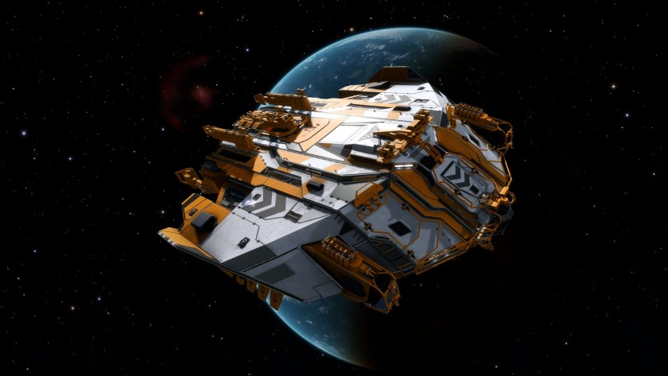

:PROPERTIES:
:ID:       08e08c3f-b85e-451d-aea8-bc39b0c85ee8
:ROAM_REFS: https://www.elitedangerous.com/equipment/starships/type-9-heavy
:END:
#+title: Type-9 Heavy
#+filetags: :ship:

* Shipyard Stats
- Fighter bay: Yes
- Multicrew: +3
- Landing pad size: LRG
- Speeds: 132 m/s top, 202 m/s boost
- Maneuverability: 0
- Jump range: 6.73 ly laden, 9.15 ly unladen
- Durability: 110 shields, 864 armour
- Hull mass: 850 t
- Cargo capacity: 348 t
- Dimensions: 33.2 m high, 117.4 m long, 115.3 m wide

