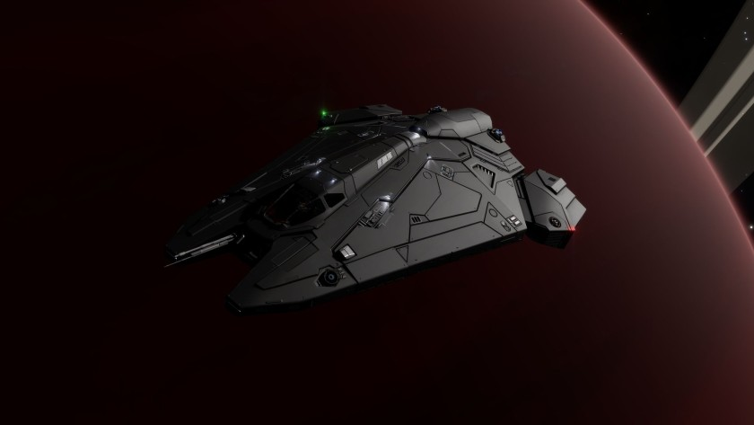

:PROPERTIES:
:ID:       5e485fd6-f859-4b8d-8b2b-c529c915795c
:ROAM_REFS: https://www.elitedangerous.com/equipment/starships/viper-mk-iii
:END:
#+title: Viper Mk III
#+filetags: :ship:

* Shipyard Stats
- Fighter bay: No
- Multicrew: -
- Landing pad size: SML
- Speeds: 316 m/s top, 395 m/s boost
- Maneuverability: 4
- Jump range: 7.51 ly laden, 8.09 ly unladen
- Durability: 137 shields, 126 armour
- Hull mass: 50 t
- Cargo capacity: 4 t
- Dimensions: 5.4 m high, 29.8 m long, 24 m wide

