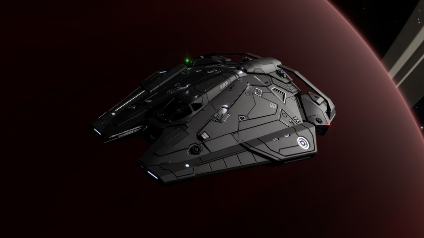

:PROPERTIES:
:ID:       91e03c76-31fd-44d3-a314-0cd01ff45f1e
:ROAM_REFS: https://www.elitedangerous.com/equipment/starships/viper-mk-iv
:END:
#+title: Viper Mk IV
#+filetags: :ship:

* Shipyard Stats
- Fighter bay: No
- Multicrew: -
- Landing pad size: SML
- Speeds: 272 m/s top, 342 m/s boost
- Maneuverability: 3
- Jump range: 9.76 ly laden, 11.04 ly unladen
- Durability: 103 shields, 270 armour
- Hull mass: 190 t
- Cargo capacity: 18 t
- Dimensions: 8.7 m high, 29.9 m long, 24.7 m wide

