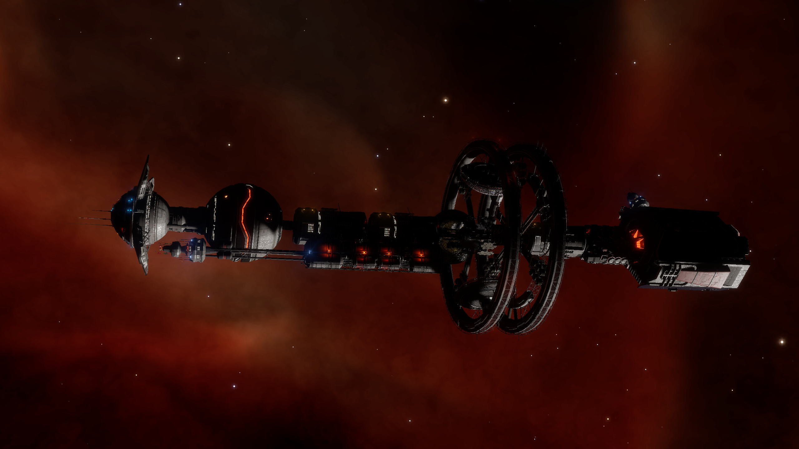
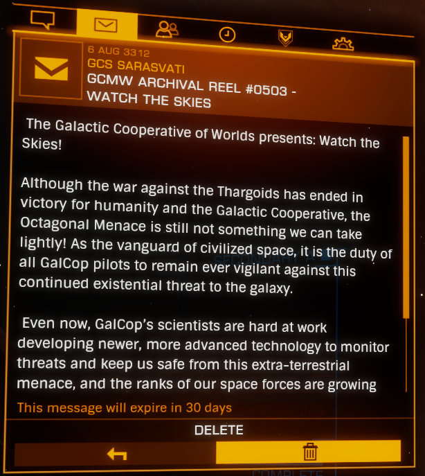
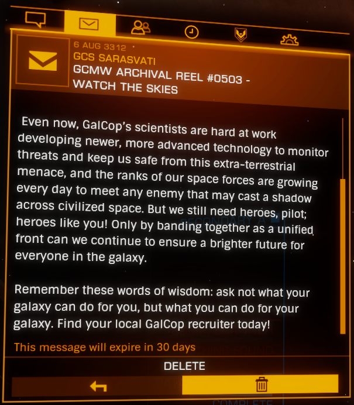
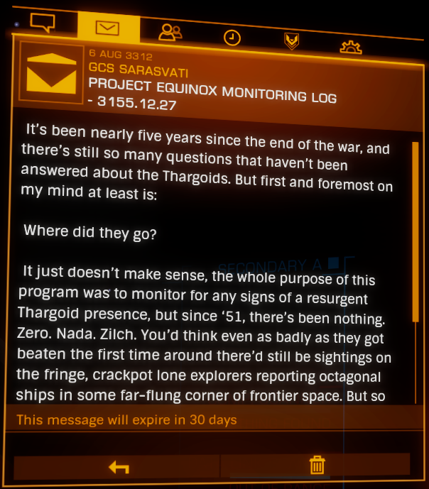
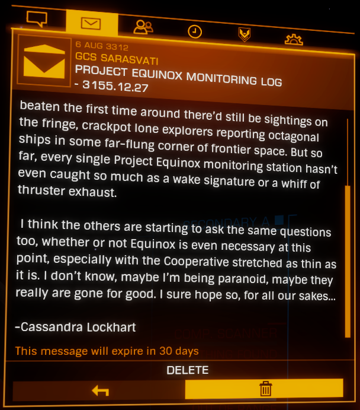
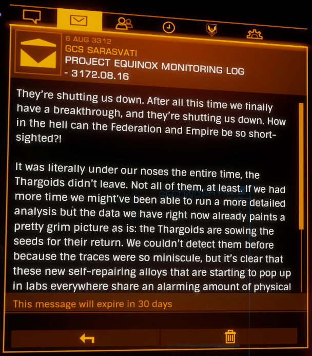
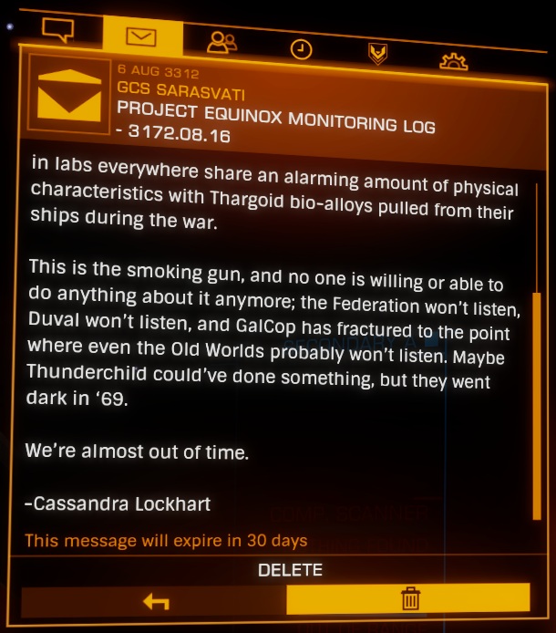
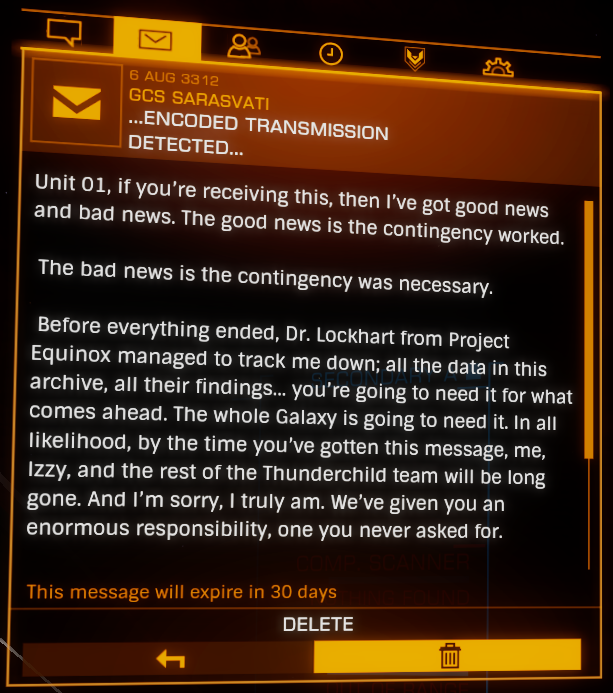
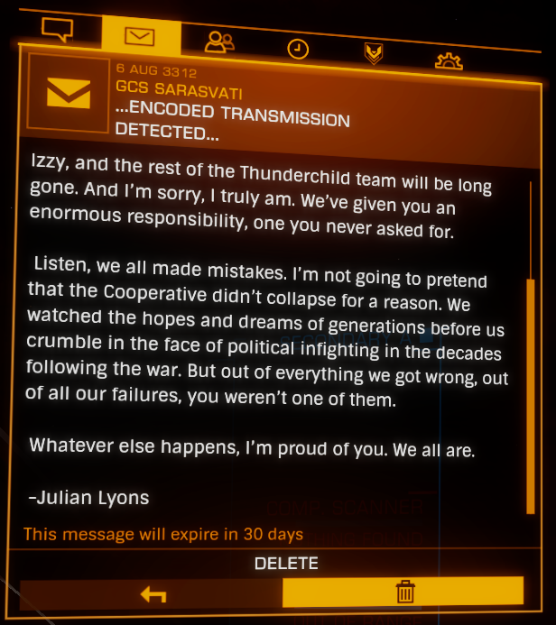

:PROPERTIES:
:ID:       3b1d78d9-62af-4251-b831-9833d5309d2f
:ROAM_REFS: https://elite-dangerous.fandom.com/wiki/GCS_Sarasvati https://canonn.science/codex/gcs-sarasvati/
:END:
#+title: GCS Sarasvati
#+filetags: :Megaship:3151:3169:3172:3155:ship:

Abandoned [[id:751c84bc-ea85-495d-923c-7776da57803a][megaship]] in orbit of [[id:729cea6c-7c2e-4fb9-b1ac-bfb07c2df0e9][Sheron]] A 1 a.

Its location was revealed by a [[id:4df4a36a-20bf-43ca-9bf1-2324f832ab81][listening post]] orbiting [[id:e34a4215-b545-4987-aedc-99d5fea6a006][Jotunheim]] 7 a, which identified [[id:6846558e-0af5-49fe-b8fb-46d630466f8e][Unit 01]] as "Project [[id:0f8ca155-6d9d-4eaf-b609-0d3bb456a0a4][Thunderchild]] Unit 01" and pointed pilots 591.10 light-years toward the vessel.

The Sarasvati is associated with [[id:837102ca-adeb-4675-a8b0-106aded4de82][Project Equinox]].

Recovered logs include material from [[id:1f7952b5-0eab-4dd0-b07d-b7fb9e5603fa][Cassandra Lockhart]] and an encoded transmission from [[id:d55211e6-b32e-424e-b21c-3cb1fdd9f676][Julian Lyons]].

* Recovered Logs

#+begin_quote
GCMW ARCHIVAL REEL #0503 – WATCH THE SKIES

The Galactic Cooperative of Worlds presents: Watch the Skies!

Although the war against the Thargoids has ended in victory for humanity and the Galactic Cooperative, the Octagonal Menace is still not something we can take lightly! As the vanguard of civilized space, it is the duty of all GalCop pilots to remain ever vigilant against this continued existential threat to the galaxy.

Even now, [[id:c71d963e-1933-4701-bb5a-d2a4332125c5][GalCop]]’s scientists are hard at work developing newer, more advanced technology to monitor threats and keep us safe from this extra-terrestrial menace, and the ranks of our space forces are growing every day to meet any enemy that may cast a shadow across civilized space. But we still need heroes, pilot; heroes like you! Only by banding together as a unified front can we continue to ensure a brighter future for everyone in the galaxy.

Remember these words of wisdom: ask not what your galaxy can do for you, but what you can do for your galaxy. Find your local GalCop recruiter today!
#+end_quote

#+begin_quote
PROJECT EQUINOX MONITORING LOG 3155.12.27

It’s been nearly five years since the end of the war, and there’s still so many questions that haven’t been answered about the Thargoids. But first and foremost on my mind at least is:

Where did they go?

It just doesn’t make sense, the whole purpose of this program was to monitor for any signs of a resurgent Thargoid presence, but since ’51, there’s been nothing. Zero. Nada. Zilch. You’d think even as badly as they got beaten the first time around there’d still be sightings on the fringe, crackpot lone explorers reporting octagonal ships in some far-flung corner of frontier space. But so far, every single Project Equinox monitoring station hasn’t even caught so much as a wake signature or a whiff of thruster exhaust.

I think the others are starting to ask the same questions too, whether or not Equinox is even necessary at this point, especially with the Cooperative stretched as thin as it is. I don’t know, maybe I’m being paranoid, maybe they really are gone for good. I sure hope so, for all our sakes…

-Cassandra Lockhart
#+end_quote

#+begin_quote
PROJECT EQUINOX MONITORING LOG – 3172.08.16

They’re shutting us down. After all this time we finally have a breakthrough, and they’ re shutting us down. How in the hell can the Federation and Empire be so shortsighted?

Iit was literally under our noses the entire time, the Thargoids didn’t leave. Not all of them, at least. If we had more time we might’ve been able to run a more detailed analysis but the data we have right now already paints a pretty grim picture as is: the Thargoids are sowing the seeds for their return. We couldn’t detect them before because the traces were so miniscule, but it’s clear that these new self-repairing alloys that are starting to pop up in labs everywhere share an alarming amount of physical characteristics with Thargoid bio-alloys pulled from their ships during the war.

This is the smoking gun, and no one is willing or able to do anything about it anymore; the Federation won’t listen, [[id:f89dda0b-2c78-414c-9567-8a79beab46a7][Duval]] won’t listen, and GalCop has fractured to the point where even the Old Worlds probably won’t listen. Maybe Thunderchild could’ve done something, but they went dark in ’69.

We’re almost out of time.

-Cassandra Lockhart
#+end_quote

#+begin_quote
…ENCODED TRANSMISSION DETECTED…

Unit 01, if you’re receiving this, then I’ve got good news and bad news. The good news is the contingency worked.

The bad news is the contingency was necessary.

Before everything ended, Dr, [[id:1f7952b5-0eab-4dd0-b07d-b7fb9e5603fa][Lockhart]] from [[id:837102ca-adeb-4675-a8b0-106aded4de82][Project Equinox]] managed to track me down; all the data in this archive, all their findings… you’re going to need it for what comes ahead. The whole Galaxy is going to need it. In all likelihood, by the time you’ve gotten this message, me, [[id:14821546-884c-4105-865c-177d931bf1e4][Izzy]], and the rest of the [[id:0f8ca155-6d9d-4eaf-b609-0d3bb456a0a4][Thunderchild]] team will be long gone. And I’m sorry, I truly am. We’ve given you an enormous responsibility, one you never asked for.

Listen, we all made mistakes. I’m not going to pretend that the Cooperative didn’t collapse for a reason. We watched the hopes and dreams of generations before us crumble in the face of political infighting in the decades following the war. But out of everything we got wrong, out of all our failures, you weren’t one of them.

Whatever else happens, I’m proud of you. We all are.

-Julian Lyons
#+end_quote

