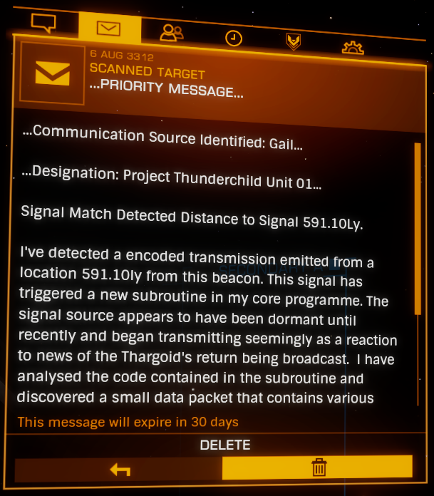
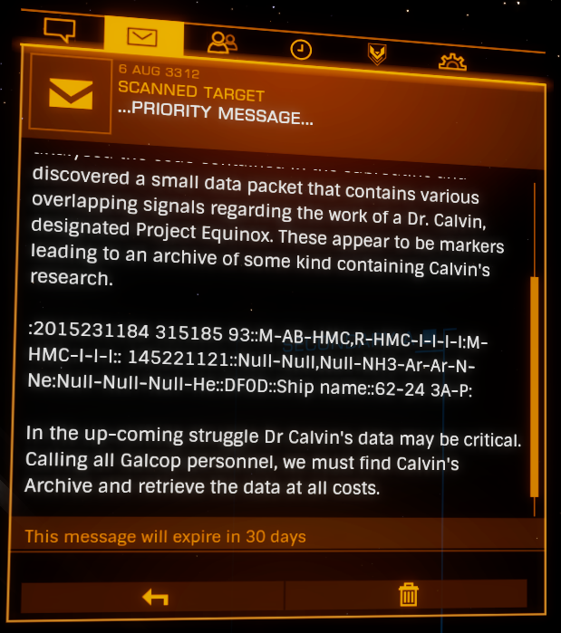
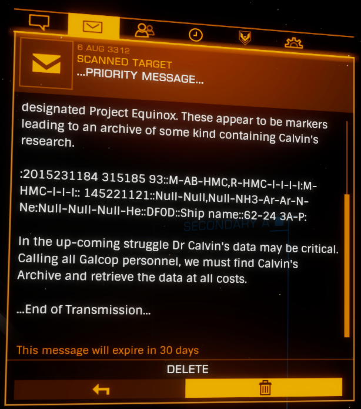

:PROPERTIES:
:ID:       6846558e-0af5-49fe-b8fb-46d630466f8e
:ROAM_REFS: https://elite-dangerous.fandom.com/wiki/Unit_01 https://canonn.science/codex/gcs-sarasvati/
:END:
#+title: Unit 01
#+filetags: :Individual:

Designation identified by the [[id:4df4a36a-20bf-43ca-9bf1-2324f832ab81][listening post]] orbiting [[id:e34a4215-b545-4987-aedc-99d5fea6a006][Jotunheim]] 7 a as "Project [[id:0f8ca155-6d9d-4eaf-b609-0d3bb456a0a4][Thunderchild]] Unit 01".

The transmission led pilots toward [[id:3b1d78d9-62af-4251-b831-9833d5309d2f][GCS Sarasvati]] in [[id:729cea6c-7c2e-4fb9-b1ac-bfb07c2df0e9][Sheron]].

#+begin_quote
…PRIORITY MESSAGE…

…Communication Source Identified: Gail…

…Designation: Project Thunderchild Unit 01…

Signal Match Detected Distance to Signal 591.10Ly.

I’ve detected a encoded transmission emitted from a location 591.10ly from this beacon. This signal has triggered a new subroutine in my core programme. The signal source appears to have been dormant until recently and began transmitting seemingly as a reaction to news of the Thargoid’s return being broadcast. I have analysed the code contained in the subroutine and discovered a small data packet that contains various overlapping signals regarding the work of a Dr. Calvin, designated Project Equinox. These appear to be markers leading to an archive of some kind containing Calvin’s research.

:2015231184 315185
93::M-AB-HMC,R-HMC-I-I-I-I:M-HMC-I-I-I::
145221121::Null­-Null,Null-NH3-Ar-Ar-N-Ne:Null-Null-Null-He::DF0D::Ship name::62-24 3A-P:

In the up-coming struggle Dr Calvin’s data may be critical. Calling all Galcop personnel, we must find Calvin’s Archive and retrieve the data at all costs.

…End of Transmission…
#+end_quote

