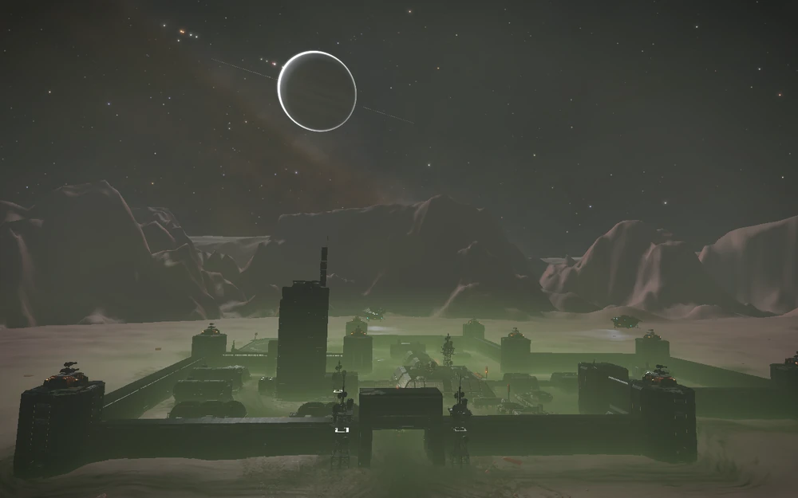
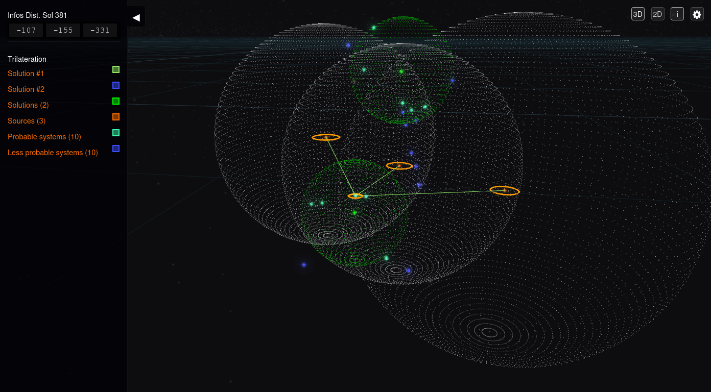

:PROPERTIES:
:ID:       e121d10f-8ea7-4842-8988-4b3aec463ebf
:ROAM_REFS: https://canonn.science/codex/penal-colony-bv-2259/
:END:
#+title: Penal Colony BV-2259
#+filetags: :Thargoid:Settlement:

Penal Colony BV-2259 is an abandoned penal colony that has been
attacked by Thargoids in the [[id:6792df45-d11b-47aa-b3a5-814875cbc05c][HIP 16217]] system on body [[https://edgis.elitedangereuse.fr/static/sysmap.html?system=HIP+16217&body_id=18][AB 1 a]].

Colony automated defence is still online. If you visit during a
Thargoid attack, the defences may be seen firing back. Some commanders
have also reported being fired upon when landed on the colony landing
pad. This in inevitably fatal.

The location of this site can be found by following the three nearby [[id:4df4a36a-20bf-43ca-9bf1-2324f832ab81][listening posts]] located in:
[[id:8e9b5a29-b9a6-4987-8fcd-91234a4a0acd][Electra]] / [[id:7778d101-a0ed-4943-b9a7-b93aded323d9][Pleiades Sector PD-S b4-0]] / [[id:287ae6a7-95e6-4a7a-9108-01f8995753fc][Pleiades Sector KC-V c2-4]]

* Trilateration results

[[https://elitedangereuse.fr/outils/trilateration.php?sys1=Electra&sys2=Pleiades+Sector+PD-S+B4-0&sys3=Pleiades+Sector+KC-V+c2-4&d1=37&d2=28&d3=24&sphs=1&sphsol=1&hud=1][Trilateration of the location]]

* Logs

#+begin_quote
IN THE COOLER 1/4

[[id:cda46b82-514a-438c-9aa7-54c6b57a4216][Chief Warden Halil]] – Penal Colony Report N67P-23

As if running this facility wasn’t challenging enough, now we’re
having problems with transit. I suppose that’s what we get for using
private contractors instead of official transport. The pilot gave some
cockamamie story about being intercepted by an unidentified
ship. Apparently it looked “alien” and closed down his systems. Left
him stranded for a while. Whatever. I wasn’t in the mood to listen to
some void-crazy pilot’s inane wittering. All I know is, by the time he
got here the prisoners were ready to riot.

I’ve sent a strongly-worded memo to the authorities demanding we use
union-approved contractors from now on.
#+end_quote

[[file:audio/Settlements/Penal Colony BV 2259/In-The-Cooler-1-4.ogg]]

#+begin_quote
IN THE COOLER 2/4

[[id:cda46b82-514a-438c-9aa7-54c6b57a4216][Chief Warden Halil]] – Penal Colony Report N67P-24

We have an emergency Situation. At first I thought there’d been a
breakout. I couldn’t have been more wrong. They jumped in right on top
of us - the proximity relays didn’t catch a thing. It was just two
ships, but they shut down our defences before we even had a chance to
get them online. Then they hit the facility with some kind of pulse.

Life support is still functional, but all other systems are
fried. Luckily the wardens had the presence of mind to initiate manual
lockdown on all cellblocks, so the prisoners remain
contained. Unfortunately I’m sealed inside the Command Centre. I’ve
sent a mayday signal, and I tried hailing whoever attacked us, but so
far no luck. We’ll just have to wait this out and hope for the best.
#+end_quote

[[file:audio/Settlements/Penal Colony BV 2259/In-The-Cooler-2-4.ogg]]

#+begin_quote
IN THE COOLER 3/4

[[id:cda46b82-514a-438c-9aa7-54c6b57a4216][Chief Warden Halil]] – Penal Colony Report N67P-25

Someone has to come soon. We lost contact with Central two days
ago. Surely the alarm will have been raised by now? I’m trying to
jury-rig the surveillance system so I can see what’s going on in the
rest of the facility, but the temperature’s dropping by the hour. Sure
as hell isn’t making the job any easier. The life-support readings say
everything is fine. So why is it so cold in here?
#+end_quote

[[file:audio/Settlements/Penal Colony BV 2259/In-The-Cooler-3-4.ogg]]

#+begin_quote
IN THE COOLER 4/4

[[id:cda46b82-514a-438c-9aa7-54c6b57a4216][Chief Warden Halil]] – Penal Colony Report N67P-26

It’s got to be at least twenty below in here. My hands are numb. Gotta be honest, I’ve had better days.

I got the surveillance system working again. Looking at the monitors now. The prisoners, the wardens…every last one of them has gone. Whatever shut the facility down must have taken them. But why?

And why did they drop the temperature?

I don’t know, but I do know I’m freezing to death. I can’t decide what’s worse – Slowly dying in this ice cube, or being taken by whatever it is out there. Guess I don’t have much of a choice.
#+end_quote

[[file:audio/Settlements/Penal Colony BV 2259/In-The-Cooler-4-4.ogg]]
