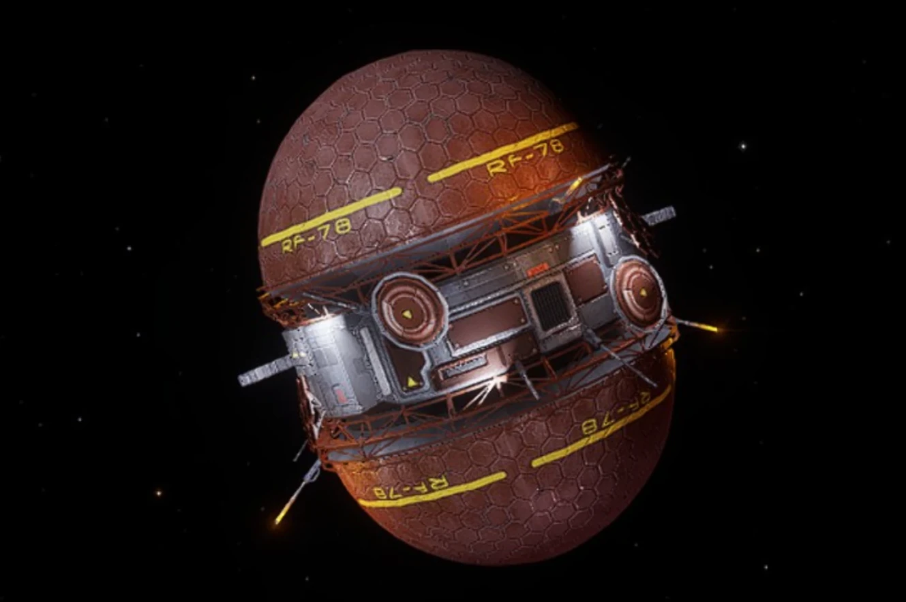

:PROPERTIES:
:ID:       c04b9f3f-3db6-4fb4-a572-c4f58545f3c0
:END:
#+title: Colonisation Beacon

The [[id:ef56313c-66b2-4a2e-bfbd-9a1316101e95][nav beacon]] marks the location where the [[id:971c624f-bca8-4e23-b5bb-a57351cb1838][system colonisation]]
process started. It's initially called a Colonisation Beacon which
must be deployed within 24 hours after purchasing a star system claim
from a Colonisation Contact. When the primary starport is built
then it becomes a Nav Beacon.

